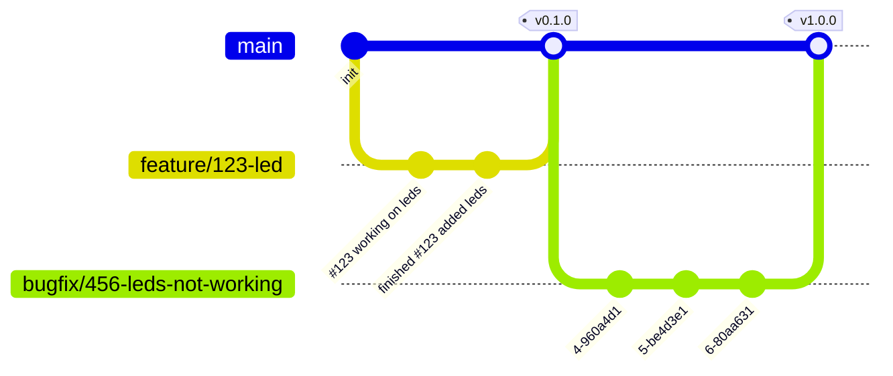
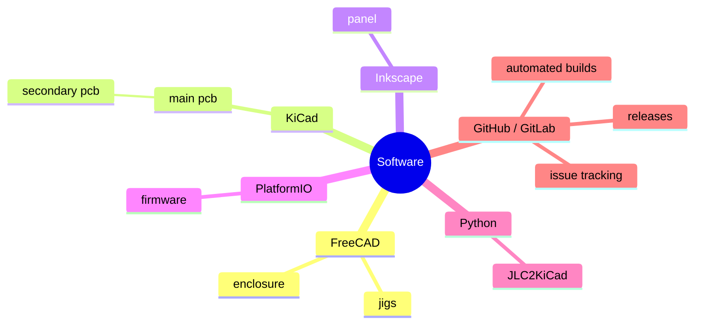

---
config:
  theme: "forest"
  themeVariables:
    darkMode: true
---

# eurorack-template

A boilerplate of recommended defaults and best practices for Eurorack repos

## Feature Branch Workflow

It is recommended that a strict adherance to GitHub issue tracking and the [feature branch workflow](https://www.atlassian.com/git/tutorials/comparing-workflows/feature-branch-workflow) be followed.

- make a GitHub issue for each feature
- write the issue number in each commit to track progress
- make a new branch per issue prefixed with `feature/` or `bugfix/`
- write "fixes" or "finished" to automatically close the issue on a commit that merges into master either in the commit message or in a pull request if working with multiple people
- add tags to the main branch to track releases
- attach zip files to releases manually

## Free Open Source Software

This boilerplate assumes all of the software used is free & open source. You're free to replace any part with a paid solution, but this will impact the accessibility to others. Each directory has more detailed instructions inside of its own readme file on how to get started.
